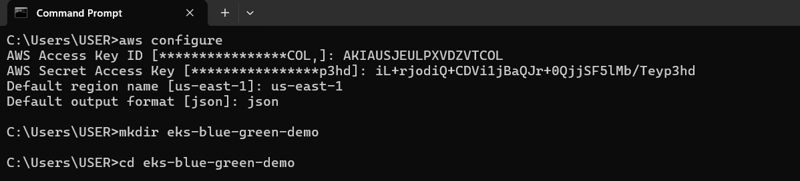
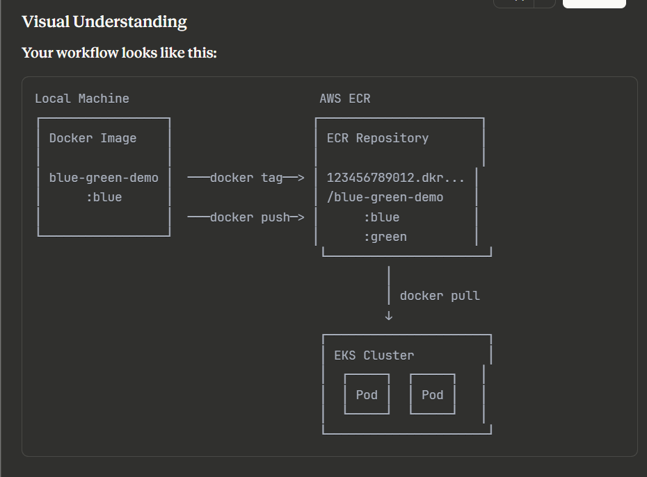
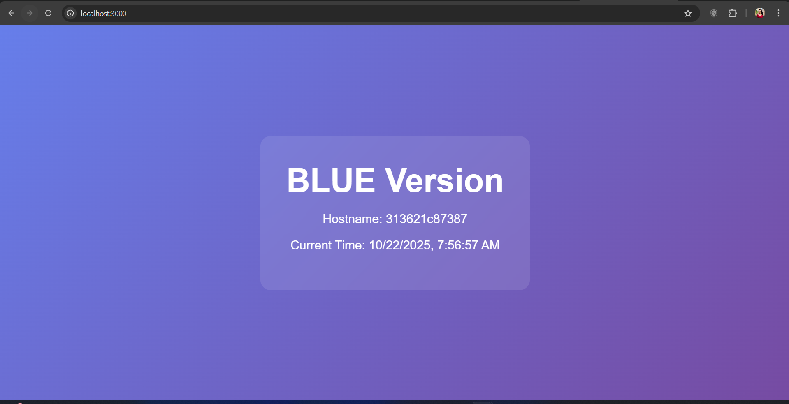
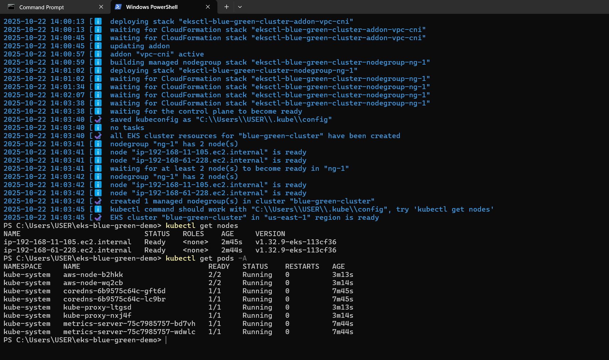
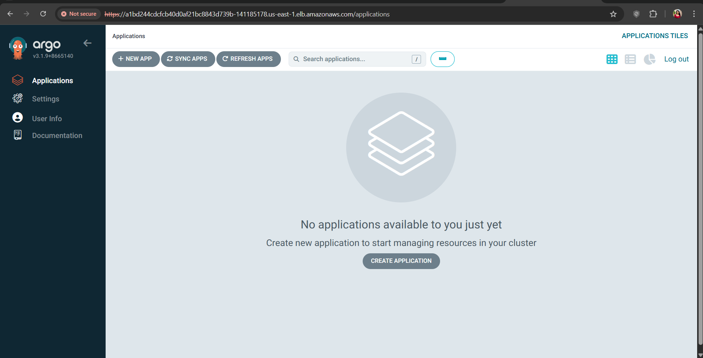
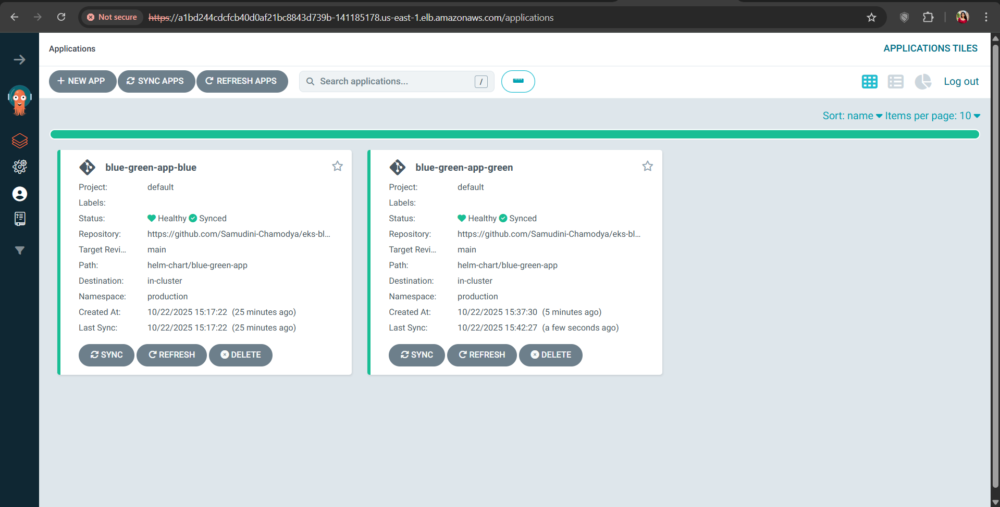
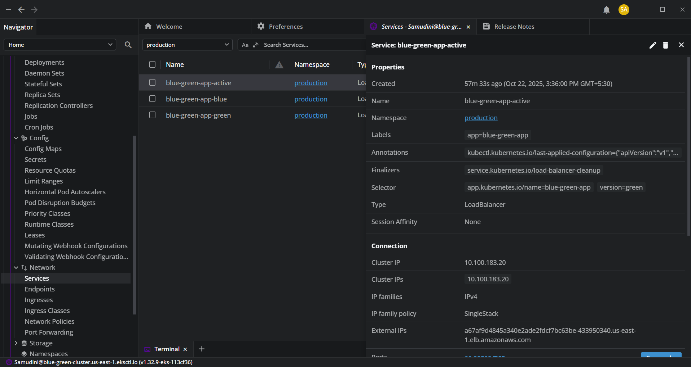
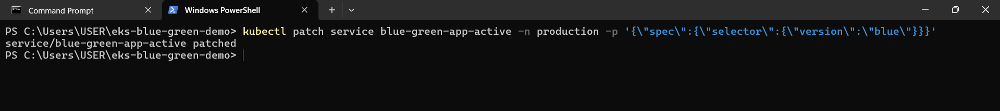
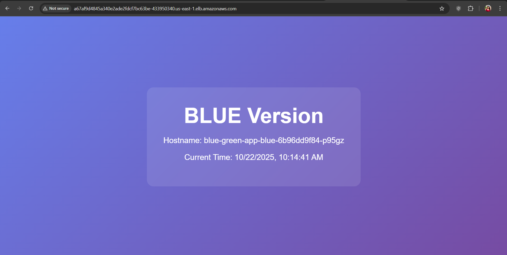
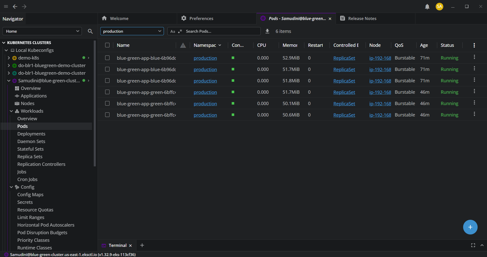

# AWS EKS Blue-Green Deployment with ArgoCD & Helm

A comprehensive guide to implementing a production-ready CI/CD pipeline with blue-green deployment strategy on AWS EKS using ArgoCD and Helm.


## 📋 Table of Contents

- [Overview](#overview)
- [Architecture](#architecture)
- [Prerequisites](#prerequisites)
- [Installation Guide](#installation-guide)
- [Project Structure](#project-structure)
- [Deployment Process](#deployment-process)
- [Blue-Green Switching](#blue-green-switching)
- [Monitoring](#monitoring)
- [Troubleshooting](#troubleshooting)
- [Cleanup](#cleanup)
- [Cost Estimation](#cost-estimation)

---

## 🎯 Overview

This project demonstrates:
- ✅ AWS EKS cluster setup with managed node groups
- ✅ GitOps workflow using ArgoCD
- ✅ Helm charts for application packaging
- ✅ Blue-green deployment strategy
- ✅ Zero-downtime deployments
- ✅ Container registry with Amazon ECR
- ✅ Automated CI/CD with GitHub Actions
- ✅ Security best practices

**Tech Stack:**
- AWS EKS (Kubernetes 1.28)
- ArgoCD (GitOps)
- Helm (Package Manager)
- Amazon ECR (Container Registry)
- Node.js + Express (Demo Application)
- GitHub Actions (CI/CD)

---

## 🏗️ Architecture

```
┌─────────────────────────────────────────────────────────────────┐
│                        AWS Cloud (us-east-1)                     │
│                                                                   │
│  ┌─────────────────────────────────────────────────────────┐   │
│  │                    EKS Cluster                           │   │
│  │                                                           │   │
│  │  ┌──────────────┐              ┌──────────────┐         │   │
│  │  │ Blue Pods    │              │ Green Pods   │         │   │
│  │  │ (v1.0)       │              │ (v2.0)       │         │   │
│  │  │  ┌───┐┌───┐  │              │  ┌───┐┌───┐ │         │   │
│  │  │  │Pod││Pod│  │              │  │Pod││Pod│ │         │   │
│  │  │  └───┘└───┘  │              │  └───┘└───┘ │         │   │
│  │  └───────┬──────┘              └───────┬──────┘         │   │
│  │          │                             │                │   │
│  │          └──────────┬──────────────────┘                │   │
│  │                     │                                   │   │
│  │            ┌────────▼────────┐                          │   │
│  │            │  Active Service │ ◄─── Traffic Routing    │   │
│  │            │  (LoadBalancer) │                          │   │
│  │            └────────┬────────┘                          │   │
│  │                     │                                   │   │
│  └─────────────────────┼───────────────────────────────────┘   │
│                        │                                        │
│  ┌─────────────────────▼───────────────────────────────────┐   │
│  │                   AWS Load Balancer                      │   │
│  └─────────────────────┬───────────────────────────────────┘   │
│                        │                                        │
└────────────────────────┼────────────────────────────────────────┘
                         │
                    Internet Users
                         
┌────────────────────────────────────────────────────────────────┐
│                      GitOps Workflow                            │
│                                                                  │
│  Developer ─► GitHub ─► GitHub Actions ─► ECR ─► ArgoCD ─► EKS │
└────────────────────────────────────────────────────────────────┘
```

**Blue-Green Deployment Flow:**
1. Both blue and green environments run simultaneously
2. Active service points to one version (e.g., blue)
3. Deploy new version to inactive environment (green)
4. Test green environment
5. Switch traffic from blue to green
6. Blue becomes the rollback option

---

## 📦 Prerequisites

### Required Tools (Windows)


| Tool | Version | Purpose |
|------|---------|---------|
| AWS CLI | Latest | AWS resource management |
| kubectl | 1.28+ | Kubernetes cluster management |
| Helm | 3.12+ | Kubernetes package manager |
| eksctl | Latest | EKS cluster provisioning |
| Docker Desktop | Latest | Container building |
| Git | Latest | Version control |
| PowerShell | 5.1+ | Script execution |

### AWS Requirements

- AWS Account with administrative access
- IAM user with permissions for:
  - EKS (full access)
  - EC2 (full access)
  - VPC (full access)
  - CloudFormation (full access)
  - IAM (create/manage roles)
  - ECR (full access)

---

## 🚀 Installation Guide

### Step 1: Install Tools (Windows)

#### 1.1 Install Chocolatey


```powershell
# Run PowerShell as Administrator
Set-ExecutionPolicy Bypass -Scope Process -Force
[System.Net.ServicePointManager]::SecurityProtocol = [System.Net.ServicePointManager]::SecurityProtocol -bor 3072
iex ((New-Object System.Net.WebClient).DownloadString('https://community.chocolatey.org/install.ps1'))
```

**Expected Output:**
```
Chocolatey v1.x.x installed successfully.
```

#### 1.2 Install Required Tools


```powershell
# Install all tools at once
choco install awscli kubernetes-cli kubernetes-helm eksctl git docker-desktop -y
```

#### 1.3 Verify Installations

```powershell
aws --version        # aws-cli/2.x.x
kubectl version --client  # v1.28.x
helm version         # v3.12.x
eksctl version       # 0.x.x
git --version        # git version 2.x.x
docker --version     # Docker version 24.x.x
```

### Step 2: Configure AWS Credentials

#### 2.1 Setup AWS CLI



```powershell
aws configure
```

**Enter the following:**
```
AWS Access Key ID [None]: YOUR_ACCESS_KEY
AWS Secret Access Key [None]: YOUR_SECRET_KEY
Default region name [None]: us-east-1
Default output format [None]: json
```

#### 2.2 Verify AWS Connection

```powershell
aws sts get-caller-identity
```

**Expected Output:**
```json
{
    "UserId": "AIDAXXXXXXXXXX",
    "Account": "123456789012",
    "Arn": "arn:aws:iam::123456789012:user/your-username"
}
```

---

## 📁 Project Structure

### Step 3: Create Project Structure

#### 3.1 Initialize Project



```powershell
mkdir eks-blue-green-demo
cd eks-blue-green-demo
git init
```

**Final Structure:**
```
eks-blue-green-demo/
├── app.js                          # Node.js application
├── package.json                    # NPM dependencies
├── Dockerfile                      # Container image definition
├── .dockerignore                   # Docker ignore rules
├── eks-cluster-config.yaml         # EKS cluster configuration
├── helm-chart/                     # Helm charts
│   └── blue-green-app/
│       ├── Chart.yaml
│       ├── values.yaml
│       ├── templates/
│       │   ├── deployment.yaml
│       │   ├── service.yaml
│       │   └── _helpers.tpl
│       └── envs/
│           ├── blue-values.yaml
│           └── green-values.yaml
├── argocd/                         # ArgoCD applications
│   ├── blue-application.yaml
│   └── green-application.yaml
├── k8s/                           # Kubernetes manifests
│   ├── service-active.yaml
│   ├── network-policy.yaml
│   └── pod-security.yaml
├── .github/
│   └── workflows/
│       └── deploy.yaml            # CI/CD pipeline
└── README.md
```

#### 3.2 Create Application Files

**app.js:**
```javascript
const express = require('express');
const app = express();
const PORT = process.env.PORT || 3000;
const VERSION = process.env.VERSION || 'blue';

app.get('/', (req, res) => {
    res.send(`
        <!DOCTYPE html>
        <html>
        <head>
            <title>Blue-Green Demo</title>
            <style>
                body {
                    display: flex;
                    justify-content: center;
                    align-items: center;
                    height: 100vh;
                    margin: 0;
                    font-family: Arial, sans-serif;
                    background: ${VERSION === 'blue' ? 
                        'linear-gradient(135deg, #667eea 0%, #764ba2 100%)' : 
                        'linear-gradient(135deg, #f093fb 0%, #f5576c 100%)'};
                    color: white;
                }
                .container {
                    text-align: center;
                    padding: 50px;
                    background: rgba(255,255,255,0.1);
                    border-radius: 20px;
                    backdrop-filter: blur(10px);
                }
                h1 { font-size: 4em; margin: 0; }
                p { font-size: 1.5em; }
            </style>
        </head>
        <body>
            <div class="container">
                <h1>${VERSION.toUpperCase()} Version</h1>
                <p>Hostname: ${require('os').hostname()}</p>
                <p>Current Time: ${new Date().toLocaleString()}</p>
            </div>
        </body>
        </html>
    `);
});

app.get('/health', (req, res) => {
    res.status(200).json({ status: 'healthy', version: VERSION });
});

app.listen(PORT, () => {
    console.log(`Server running on port ${PORT} - Version: ${VERSION}`);
});
```

#### 3.3 Build and Test Locally


 
```powershell
# Build the image
docker build -t blue-green-demo:blue .
```

```powershell
# Test locally
docker run -d -p 3000:3000 -e VERSION=blue --name test-app blue-green-demo:blue
```



Open browser to `http://localhost:3000` - You should see the blue version.

```powershell
# Cleanup
docker stop test-app
docker rm test-app
```

---

## ☁️ AWS Infrastructure Setup

### Step 4: Create EKS Cluster

#### 4.1 Create Cluster Configuration

**eks-cluster-config.yaml:**
```yaml
apiVersion: eksctl.io/v1alpha5
kind: ClusterConfig

metadata:
  name: blue-green-cluster
  region: us-east-1
  version: "1.28"

iam:
  withOIDC: true

managedNodeGroups:
  - name: ng-1
    instanceType: t3.medium
    minSize: 2
    maxSize: 4
    desiredCapacity: 2
    volumeSize: 20
    ssh:
      allow: false
    labels:
      role: worker
    tags:
      Environment: development
      Project: blue-green-demo

cloudWatch:
  clusterLogging:
    enableTypes: ["api", "audit", "authenticator", "controllerManager", "scheduler"]
```

#### 4.2 Create the Cluster


```powershell
eksctl create cluster -f eks-cluster-config.yaml
```

**This takes 15-20 minutes.** Expected output:

```
[ℹ]  eksctl version 0.x.x
[ℹ]  using region us-east-1
[ℹ]  setting availability zones to [us-east-1a us-east-1b]
[ℹ]  subnets for us-east-1a - public:xxx private:xxx
[ℹ]  subnets for us-east-1b - public:xxx private:xxx
[ℹ]  nodegroup "ng-1" will use "ami-xxxxx" [AmazonLinux2/1.28]
[ℹ]  creating EKS cluster "blue-green-cluster" in "us-east-1" region
...
[✔]  EKS cluster "blue-green-cluster" in "us-east-1" region is ready
```

#### 4.3 Verify Cluster



```powershell
# Check nodes
kubectl get nodes

# Expected output:
NAME                         STATUS   ROLES    AGE   VERSION
ip-xxx-xxx-xxx-xxx.ec2...    Ready    <none>   2m    v1.28.x
ip-xxx-xxx-xxx-xxx.ec2...    Ready    <none>   2m    v1.28.x
```

**AWS Console:** Navigate to EKS service to see your cluster.

### Step 5: Setup Amazon ECR

#### 5.1 Create ECR Repository


```powershell
aws ecr create-repository --repository-name blue-green-demo --region us-east-1
```

**Expected Output:**
```json
{
    "repository": {
        "repositoryArn": "arn:aws:ecr:us-east-1:123456789:repository/blue-green-demo",
        "registryId": "123456789",
        "repositoryName": "blue-green-demo",
        "repositoryUri": "123456789.dkr.ecr.us-east-1.amazonaws.com/blue-green-demo"
    }
}
```

#### 5.2 Login to ECR


```powershell
$AWS_ACCOUNT_ID = aws sts get-caller-identity --query Account --output text
$AWS_REGION = "us-east-1"

aws ecr get-login-password --region $AWS_REGION | docker login --username AWS --password-stdin "$AWS_ACCOUNT_ID.dkr.ecr.$AWS_REGION.amazonaws.com"
```

**Expected:** `Login Succeeded`

#### 5.3 Push Images to ECR

```powershell
# Tag and push blue version
docker tag blue-green-demo:blue "$AWS_ACCOUNT_ID.dkr.ecr.$AWS_REGION.amazonaws.com/blue-green-demo:blue"
docker push "$AWS_ACCOUNT_ID.dkr.ecr.$AWS_REGION.amazonaws.com/blue-green-demo:blue"

# Build, tag, and push green version
docker build -t blue-green-demo:green .
docker tag blue-green-demo:green "$AWS_ACCOUNT_ID.dkr.ecr.$AWS_REGION.amazonaws.com/blue-green-demo:green"
docker push "$AWS_ACCOUNT_ID.dkr.ecr.$AWS_REGION.amazonaws.com/blue-green-demo:green"
```

**Verify in AWS Console:** You should see both `blue` and `green` tags.

---

## 🎨 Helm Chart Setup

### Step 6: Create Helm Chart

#### 6.1 Generate Chart Structure

```powershell
mkdir helm-chart
cd helm-chart
helm create blue-green-app
```

#### 6.2 Configure values.yaml

Update `helm-chart/blue-green-app/values.yaml` with your ECR repository URL:

```yaml
replicaCount: 3

image:
  repository: <YOUR_ACCOUNT_ID>.dkr.ecr.us-east-1.amazonaws.com/blue-green-demo
  pullPolicy: IfNotPresent
  tag: "blue"

service:
  type: LoadBalancer
  port: 80
  targetPort: 3000

resources:
  limits:
    cpu: 200m
    memory: 256Mi
  requests:
    cpu: 100m
    memory: 128Mi

env:
  - name: VERSION
    value: "blue"
  - name: PORT
    value: "3000"

livenessProbe:
  httpGet:
    path: /health
    port: 3000
  initialDelaySeconds: 30
  periodSeconds: 10

readinessProbe:
  httpGet:
    path: /health
    port: 3000
  initialDelaySeconds: 5
  periodSeconds: 5
```

#### 6.3 Create Environment-Specific Values

```powershell
mkdir -p helm-chart/blue-green-app/envs
```

Create `envs/blue-values.yaml` and `envs/green-values.yaml` as shown in the documentation.

---

## 🔄 ArgoCD Installation

### Step 7: Install ArgoCD

#### 7.1 Install ArgoCD



```powershell
# Create namespace
kubectl create namespace argocd

# Install ArgoCD
kubectl apply -n argocd -f https://raw.githubusercontent.com/argoproj/argo-cd/stable/manifests/install.yaml

# Wait for pods
kubectl wait --for=condition=Ready pods --all -n argocd --timeout=300s
```

#### 7.2 Expose ArgoCD UI


```powershell
# Change to LoadBalancer
kubectl patch svc argocd-server -n argocd -p '{"spec": {"type": "LoadBalancer"}}'

# Get URL
kubectl get svc argocd-server -n argocd
```

#### 7.3 Get Admin Password


```powershell
$ARGOCD_PASSWORD = kubectl -n argocd get secret argocd-initial-admin-secret -o jsonpath="{.data.password}" | ForEach-Object { [System.Text.Encoding]::UTF8.GetString([System.Convert]::FromBase64String($_)) }
Write-Host "ArgoCD Admin Password: $ARGOCD_PASSWORD"
```
## 🚢 Deployment Process

### Step 8: Deploy with ArgoCD

#### 8.1 Push to GitHub

```powershell
git add .
git commit -m "Initial commit - Blue-Green deployment setup"
git branch -M main
git remote add origin https://github.com/YOUR_USERNAME/eks-blue-green-demo.git
git push -u origin main
```

#### 8.2 Create ArgoCD Application for Blue



```powershell
# Create production namespace
kubectl create namespace production

# Apply ArgoCD application
kubectl apply -f argocd/blue-application.yaml
```

#### 8.3 Monitor Deployment

```powershell
# Watch the sync
argocd app get blue-green-app-blue --refresh
argocd app wait blue-green-app-blue --sync
```

**ArgoCD Dashboard:** Application should show as "Healthy" and "Synced".

#### 8.4 Verify Deployment


```powershell
# Check pods
kubectl get pods -n production

# Get service URL
kubectl get svc -n production
```

**Open the LoadBalancer URL** - You should see the blue version running.

---

## 🔀 Blue-Green Deployment

### Step 9: Deploy Green Environment

#### 9.1 Deploy Green Application

```powershell
kubectl apply -f argocd/green-application.yaml
argocd app wait blue-green-app-green --sync
```

**ArgoCD Dashboard:** You should now see both blue and green applications.

#### 9.2 Verify Both Environments

```powershell
kubectl get pods -n production -l app.kubernetes.io/name=blue-green-app
```

You should see 6 pods total (3 blue + 3 green).

### Step 10: Traffic Switching

#### 10.1 Current State (Blue Active)


```powershell
kubectl get svc blue-green-app-active -n production -o yaml
```

#### 10.2 Switch to Green



```powershell
.\scripts\switch-environment.ps1 -Target green
```

**Expected Output:**
```
Switching to green environment...
Waiting for traffic to switch...
Current active version: green
Active endpoints: 10.0.1.5 10.0.2.10 10.0.3.15
Switch completed! Check your browser.
```

#### 10.3 Verify Green is Active


**Browser:** Refresh the application - you should now see the green version.

```powershell
kubectl describe svc blue-green-app-active -n production
```

#### 10.4 Rollback to Blue (if needed)



```powershell
.\scripts\switch-environment.ps1 -Target blue
```



---

## 📊 Monitoring with Lens IDE

### Step 11: Monitor with Lens

#### 11.1 Connect Lens to Cluster

1. Open Lens IDE
2. File → Add Cluster
3. Select your EKS cluster

#### 11.2 View Deployments

Navigate to **Workloads → Deployments**

#### 11.3 View Pods


Navigate to **Workloads → Pods**

#### 11.4 View Logs

Click on any pod → Logs tab

#### 11.5 View Services

Navigate to **Network → Services**

#### 11.6 Real-time Switch Monitoring

Watch pods during traffic switch:
1. Keep Lens open on Pods view
2. Run switch script
3. Observe endpoints changing

---

## 🧪 Testing

### Step 12: Load Testing

#### 12.1 Run Test Script


```powershell
.\scripts\test-deployment.ps1
```

**Expected Output:**
```
Testing deployment at: http://abc123.us-east-1.elb.amazonaws.com
Request 1 - Status: 200 - Version: GREEN
Request 2 - Status: 200 - Version: GREEN
Request 3 - Status: 200 - Version: GREEN
...
```

#### 12.2 Test During Switch
1. Start the test script in one terminal
2. Switch environments in another terminal
3. Observe zero downtime

---

## 🐛 Troubleshooting

### Common Issues

#### Issue 1: Pods Not Starting

```powershell
kubectl describe pod <pod-name> -n production
kubectl logs <pod-name> -n production
```

#### Issue 2: Image Pull Errors

```powershell
# Check ECR authentication
aws ecr get-login-password --region us-east-1 | docker login --username AWS --password-stdin "$AWS_ACCOUNT_ID.dkr.ecr.us-east-1.amazonaws.com"
```

#### Issue 3: Service Not Accessible

```powershell
kubectl get svc -n production
kubectl describe svc blue-green-app-active -n production
```

Check AWS Console → EC2 → Security Groups

---

## 🧹 Cleanup

### Step 14: Delete Resources

#### 14.1 Delete Applications

```powershell
kubectl delete application blue-green-app-blue -n argocd
kubectl delete application blue-green-app-green -n argocd
```

#### 14.2 Delete Namespaces

```powershell
kubectl delete namespace production
kubectl delete namespace argocd
```

#### 14.3 Delete EKS Cluster

```powershell
eksctl delete cluster --name blue-green-cluster --region us-east-1
```

This takes 10-15 minutes.

#### 14.4 Delete ECR Repository

```powershell
aws ecr delete-repository --repository-name blue-green-demo --region us-east-1 --force
```

#### 14.5 Verify Cleanup in AWS Console

Check:
- EKS → No clusters
- ECR → No repositories
- EC2 → No running instances from cluster
- VPC → CloudFormation stacks deleted

---

### Cost Optimization Tips

1. **Delete when not in use**: Stop cluster when testing complete
2. **Use Spot Instances**: Can reduce EC2 costs by 70%
3. **Reduce node count**: Use 1 node for testing
4. **Use smaller instances**: t3.small instead of t3.medium
5. **Limit logging**: Reduce CloudWatch retention
---
